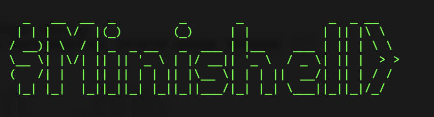

# Minishell

Minishell is a small-scale Unix shell implementation written in C, designed as a learning project to understand the fundamentals of operating systems and command-line interfaces. This project aims to replicate basic functionalities of a Unix shell, providing features such as command execution, built-in commands (e.g., cd, echo, export), environment variable handling, and basic input/output redirection.



## Features

- **Command Execution:** Execute commands entered by the user, including external programs and built-in shell commands.
- **Built-in Commands:** Implementations of common shell commands like `cd`, `echo`, `export`, `pwd`, `exit`, and `unset`.
- **Input/Output Redirection:** Support for redirecting input and output using `<`, `>`, and `>>` and heredocs `<<`
- **Piping:** Allowing the chaining of commands using `|` for input/output redirection between commands.
- **Signals Handling:** Basic signal handling for signals such as Ctrl+C (SIGINT) and Ctrl+\ (SIGQUIT) and Ctrl+D.
- **Error Handling:** Handle errors gracefully and provide informative error messages where applicable.
- **Memory Management:** Utilize dynamic memory allocation and deallocation appropriately to prevent memory leaks.

## Getting Started

### Prerequisites

Ensure you have the following installed:
- gcc or any compatible C compiler.
- `make` utility to build the project.

### Build Instructions

Clone the repository:
```
git clone https://github.com/btoksoez/minishell.git
cd minishell
```
Compile the Minishell:
```
make
```
This will compile the Minishell executable minishell.

### Usage
To run Minishell, execute the following command:
```
./minishell
```
This will start Minishell in interactive mode, where you can enter commands.

### Example Commands
Here are some examples of commands you can try in Minishell:

```
$minishell> ls -l
$minishell> echo "Hello, World!"
$minishell> cd /path/to/directory
$minishell> export PATH=$PATH:/new/directory
$minishell> cat file.txt | grep "pattern" > output.txt
$minishell> exit
```

## How Minishell Works

Minishell follows a typical shell execution flow:

Lexer: Tokenizes input commands into meaningful components.  
Parser: Parses tokens to create a binary syntax tree (BST).  
Expander: Handles expansions, such as environment variables and quotes.  
Executor: Executes commands, handling built-ins and external programs by going through the tree.  

This project taught us valuable lessons in parsing, memory management, and system calls. By recreating bash, we gained a deeper understanding of how shells interact with the operating system and manage user commands effectively.

Built with love together with [@Btk](https://github.com/btoksoez))
